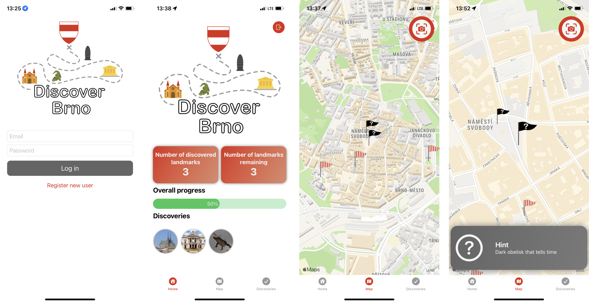

# Discover Brno
Discover Brno is an IOS mobile app meant to make discovering the Czech city of Brno more interactive and fun. After registration, users get into the main screen of the app - the map view of the city of Brno. There are places of interest highlighted on the map, where the user can find interesting landmarks of Brno. 

## Discovering the landmarks - AI model
All of the landmarks are at first not discovered. The user is meant to go to the location and find the landmark using the hint app provides. After the user thinks he/she found the landmark, picture of it must be taken in the app. The app uses custom-trained AI model to recognize supported Brno landmarks. If the landmark was recognized from the picture, it is added to the users discovery list. The user will now see the landmark highlighted as discovered on the map as well.

## Rewards - AR models
After the landmark is discovered, more information is revealed about it to the user. The user also receives a sort of reward for discovering it - an AR model of the landmark, that he/she can display at any time using the phone's camera.

## Data storage and synchronization
The app uses Realm for local db storage, which is automatically synced with backend cloud database. That means that users' progess is shared across any number of devices and is not lost when the app gets uninstalled.

## Stack
* Swift
* Swift UI
* MVVM
* Core ML
* Realm
* ARKit